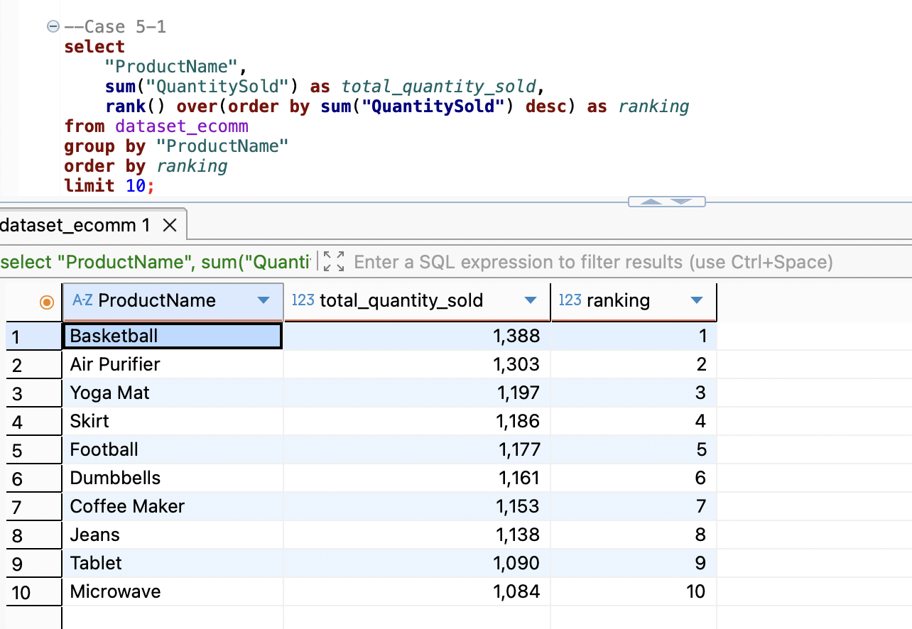

# E-Commerce SQL Business Analysis

An SQL-based analysis of e-commerce transaction data using **PostgreSQL** to prepare data, analyze transaction and revenue patterns, and generate business insights using CTEs, subqueries, date functions, aggregations, and window functions.



## 📌 Project Overview

This project explores an e-commerce transaction dataset using SQL to answer analytical questions related to transaction performance, revenue, products, and recent purchasing activity.

The analysis progresses from data preparation and standardization to business analysis using more advanced SQL techniques such as **CTEs, subqueries, and window functions**.

---

## 🎯 Analysis Objectives

The analysis focuses on:

- Preparing and standardizing transactional data
- Calculating net revenue after discounts
- Analyzing monthly transaction and revenue patterns
- Exploring recent transaction activity
- Identifying transactions with above-average price and net revenue
- Ranking products based on quantity sold
- Identifying top-performing products within each product category

---

## 📊 Dataset

The dataset contains e-commerce transaction information including:

- Product ID
- Product name
- Product category
- Price
- Quantity sold
- Discount
- Purchase date
- Customer location

These variables were used to explore product performance, transaction activity, and revenue patterns.

---

## 🧹 Data Preparation

The first stage focused on understanding and standardizing the dataset.

SQL string functions were used to:

- Create a product code using the first three letters of the product name and the last two digits of the Product ID
- Standardize customer locations using uppercase formatting
- Standardize category labels by replacing `&` with `and`
- Inspect and convert purchase dates for time-based analysis

Example techniques used:

`LEFT()` · `RIGHT()` · `CONCAT()` · `UPPER()` · `REPLACE()` · `CAST()`

---

## 🔎 Business Analysis

### 1. Net Revenue & Monthly Performance

Net revenue was calculated using product price, quantity sold, and discount:

`Net Revenue = Price × Quantity Sold × (1 - Discount / 100)`

Transactions and net revenue were then aggregated by month.

**Finding:**
- Monthly transaction volume remained relatively stable.
- Total net revenue fluctuated across months.

---

### 2. Recent Transaction Activity

Date functions and filtering were used to analyze transactions within the latest seven-day period available in the dataset.

**Finding:**
- The latest transaction date in the dataset was **26 September 2024**.
- There were **8 transactions** between 19–26 September 2024.
- Electronics appeared most frequently among transactions during this period.

---

### 3. Above-Average Transaction Analysis

Subqueries and CTEs were used to compare transactions against overall averages.

The analysis examined:

- Products with prices above the average price
- Transactions with net revenue above the average net revenue

**Finding:**
- Average product price: approximately **272.61**
- **482 transactions** had prices above the overall average.
- Average net revenue: approximately **8,627.52**
- **378 transactions** generated net revenue above the overall average.

Both **subquery and CTE approaches** were implemented to solve the same analytical problems.

---

## 🏆 Product Ranking Analysis

Window functions were used to rank products based on total quantity sold.

### Top Products by Quantity Sold

The analysis used `RANK() OVER()` to identify the top-selling products.

**Top 3 products:**

1. **Basketball** — 1,388 units
2. **Air Purifier** — 1,303 units
3. **Yoga Mat** — 1,197 units

This analysis demonstrates how aggregation and window functions can be combined to create product rankings.

---

## 📦 Product Ranking by Category

A partitioned window function was also used to rank products within each product category.

The analysis used:

`RANK() OVER (PARTITION BY Category ORDER BY SUM(QuantitySold) DESC)`

This makes it possible to identify the **Top 3 products within each category**, rather than ranking products only at the overall level.

The analysis covered categories including:

- Beauty
- Clothing
- Electronic
- Home & Garden
- Sports

---

## 💡 Key Takeaways

The SQL analysis highlights several patterns in the e-commerce dataset:

- Monthly transaction volume is relatively stable, while net revenue fluctuates.
- Recent transaction analysis can be performed dynamically based on the latest date available in the dataset.
- A substantial number of transactions have prices and net revenue above their respective averages.
- Basketball recorded the highest total quantity sold, followed by Air Purifier and Yoga Mat.
- Window functions make it possible to analyze product performance both overall and within individual categories.

These analyses demonstrate how SQL can be used not only for retrieving data, but also for preparing data and answering business-oriented analytical questions.

---

## 🛠️ SQL Techniques Used

- Data inspection
- Data preparation
- String manipulation
- Date & timestamp functions
- Filtering
- Aggregation
- `GROUP BY`
- `ORDER BY`
- Subqueries
- Common Table Expressions (CTEs)
- Window functions
- `RANK()`
- `PARTITION BY`

---

## 💻 Tools

- **PostgreSQL**
- **DBeaver**
- **SQL**

---

## 📂 Repository Structure

```text
ecommerce-sql-business-analysis/
│
├── README.md
├── ecommerce-business-analysis.sql
├── ecommerce-dataset.xlsx
└── sql-analysis-preview.png
```

---

## 🔍 Explore the SQL Analysis

The complete SQL analysis, including data preparation, analytical queries, CTEs, subqueries, window functions, and observations, is available here:

➡️ **[View SQL Analysis](ecommerce-business-analysis.sql)**

---

## 👤 Author

**Sabila Rahma Utomo**

Product Manager developing hands-on capabilities in Data Analytics to support more data-informed product and business decision-making.
